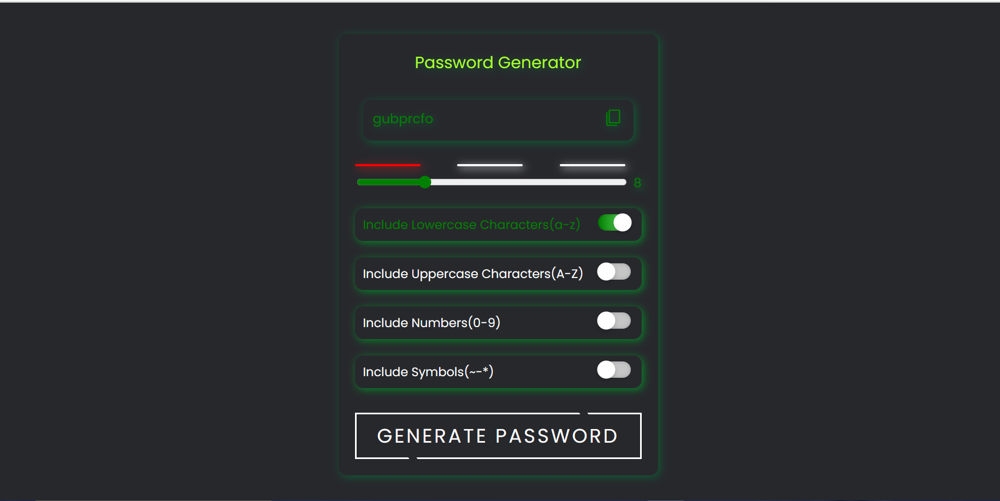

<h3>Screenshot</h3>

Key Features:

<ul><li>Implemented a customizable password generation process, allowing users to select password length and choose from various character sets, such as uppercase letters, lowercase letters, numbers, and special symbols.</li>
<li>Ensured password uniqueness and security by preventing the inclusion of ambiguous characters and incorporating best practices to avoid predictable patterns.</li>
<li>Utilized responsive design techniques to ensure the password generator works flawlessly across different devices and screen sizes, making it accessible to a broader audience.</li>
</ul>
</img>
<a href="https://hershyz-password-generator.netlify.app">Test Now🚀</a>
